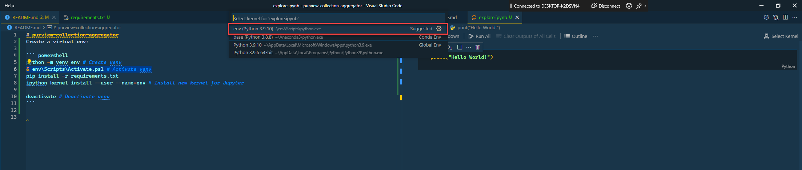

# purview-collection-aggregator
Create a virtual env:

``` powershell
# Python setup
python -m venv env # Create venv
& env\Scripts\Activate.ps1 # Activate venv
pip install -r requirements.txt
ipython kernel install --user --name=env # Install new kernel for Jupyter

# Set Environment Variables
$AZURE_CLIENT_ID = "your--client--id"
$AZURE_CLIENT_SECRET = "your--client--secret"
$AZURE_TENANT_ID = "your--tenant--id"
$PURVIEW_NAME = "your--purview--name"

[System.Environment]::SetEnvironmentVariable('AZURE_CLIENT_ID', $AZURE_CLIENT_ID,[System.EnvironmentVariableTarget]::Machine)
[System.Environment]::SetEnvironmentVariable('AZURE_CLIENT_SECRET', $AZURE_CLIENT_SECRET,[System.EnvironmentVariableTarget]::Machine)
[System.Environment]::SetEnvironmentVariable('AZURE_TENANT_ID', $AZURE_TENANT_ID,[System.EnvironmentVariableTarget]::Machine)
[System.Environment]::SetEnvironmentVariable('PURVIEW_NAME', $PURVIEW_NAME,[System.EnvironmentVariableTarget]::Machine)

deactivate # Deactivate venv
```
Virtual Environment activated:

